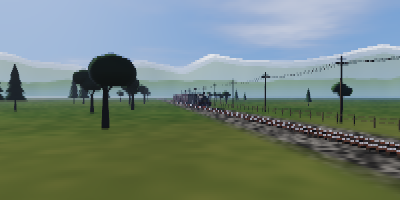

# sl-real

端末の中を、本物の蒸気機関車が走ります。

`sl` の 3D 版です。アスキーアートではなく、ソフトウェアラスタライザで組んだ
3D シーンを毎フレーム描き、四分割ブロック文字（`▘▝▖▗▚▞▛…`）と 24bit カラーで
**1 セル = 2x2 ピクセル**として端末に出します。
1 セルに置ける色は 2 つなので、4 つの小画素を二乗誤差が最小になる
2 色へ分けてから、対応する字形を選んでいます。
さらに実際は縦横 2 倍の解像度で描いてから平均して落としているので、
輪郭に階段が出ません。

どれも 200 桁 x 50 行の端末に実際に出た内容です
（アニメーションは等倍、静止画は見やすいように 2 倍に拡大）。




## 何が「リアル」なのか

- **本物の 3D**。透視投影・Z バッファ・近クリップ面付きの自前ラスタライザ。
  カメラは自由に動かせて、機関車は 12m の実寸でモデリングしてあります。
- **走り装置が実機の機構で動く**。連結棒・主連棒はもちろん、
  返りクランクから加減リンク・加減棒・合併テコ・弁棒まで
  ワルシャート式弁装置一式を、リンク長の拘束を解いて動かしています
  （2 円の交点を毎フレーム求めています）。左右の動輪は 90 度ずらしてあります。
- **煙が物理で出る**。煙突からのドラフトは動輪 1 回転につき 4 拍。
  浮力・空気抵抗・3D ノイズの乱流で、上がって流れて広がって薄まります。
  シリンダのドレンと安全弁からは白い蒸気が別に吹きます。
- **時刻で光が変わる**。太陽高度から昼・薄明・夜を連続的に作り、
  空の勾配、太陽と月、星、雲、遠景の山の空気遠近まで
  カメラレイを 1 ピクセルずつ解いて描いています。
  夜は月が主光源になり、暗部の彩度が落ちて青みがかります（薄明視）。
- **陰影は画素ごとに解く**。頂点で 3 回だけ解いて間を線形補間すると、
  円筒に多角形の帯が浮き、ハイライトが面の上を直線的に伸びてしまいます。
  ワールド座標と法線を画素ごとに補間してから陰影を解くので、
  ボイラーは継ぎ目なく丸く、ドームには正しい位置にハイライトが乗ります。
- **金属が金属に見える**。黒い車体の立体感はほとんど空の映り込みでできています。
  反射方向から空か地面の色を引き、粗さで反射のぼけ具合と彩度を変えます。
- **列車が地面に影を落とす**。地面のシェーダの中で、
  太陽へ向かう線分と車体のバウンディングボックスの交差長から半影付きで求めます。
- **視差は本物**。遠景の山は垂直な円筒との交点で解いているので、
  レイヤーごとに正しい速さで流れます。
- **輪郭が滑らか**。表示解像度の縦横 2 倍で描いてから平均して落とします
  （スーパーサンプリング）。電線や動輪のリムが途切れません。
- **接地部に陰りが出る**。深度バッファからワールド座標と法線を戻し、
  半球内のサンプルがどれだけ物陰に入るかを数えています（画面空間 AO）。
  車輪まわり、ランボードの下、車体と地面の境目が締まります。
- そのほか、煙突から出る火の粉、火室の炎の揺らぎ、乗務員のシルエット、
  夜に灯る客車の室内灯、バネ上の揺れ、煤と錆の汚れ、リベット、
  ブルームなど。

## ビルド

```sh
cargo build --release
./target/release/sl-real
```

`sl` として使うなら:

```sh
cargo install --path .
alias sl=sl-real
```

## 使い方

```
sl-real [オプション]

  --speed <m/s>     走行速度 (既定 21)
  --cars <n>        客車の両数 (既定 3)
  --time <0-24>     時刻。夕焼けや夜景が変わる (既定: 現在時刻)
  --clouds <0-1>    雲の量 (既定 0.45)
  --camera <mode>   trackside | chase | low | orbit | cab
  --loop            通り過ぎても終わらない
  --fps <n>         目標フレームレート (既定 30)
  --fov <deg>       垂直画角 (既定 42)
  --seed <n>        風景の乱数種
  --fly             機関車が飛ぶ
  --hud             速度などの情報を重ねる
  --blocks <mode>   quad = 1 セル 2x2 ピクセル（既定・横解像度が倍）
                    half = 1 セル 1x2 ピクセル（字形の対応が広い）
  --ss <auto|1-3>   スーパーサンプリング倍率。2 で輪郭が滑らかになる
                    既定の auto は端末の広さとコア数を見て 2 か 1 を選ぶ
  --ao <0-1.5>      アンビエントオクルージョンの強さ (既定 0.55、0 で切る)
```

操作: `q` 終了 / `space` 一時停止 / `c` カメラ切替 / `+` `-` 速度 /
`[` `]` 時刻 / `f` 飛ぶ / `h` HUD（速度・時刻・カメラ・煙の粒数・実測 fps）

### 見どころ

```sh
sl-real --camera low --speed 28      # レールすれすれを通過していく
sl-real --time 18.4 --camera trackside  # 夕暮れの逆光
sl-real --time 23 --camera chase     # 前照灯とかまどの火だけの夜
sl-real --camera cab --loop          # 機関士の目線でひたすら走る
sl-real --camera orbit --cars 6      # 編成をぐるりと回って見る
```

### 開発用

```sh
sl-real --screenshot out.ppm --at 4.2 --size 480x270   # 1 枚だけ書き出す
sl-real --record frames/f --frames 120 --fps 20        # 連番で書き出す
sl-real --bench 100 --size 200x50                      # 描画速度を測る（桁x行）
```

## 必要なもの

24bit カラー（truecolor）と、四分割ブロック文字 U+2596〜U+259F を持つフォント。
`alacritty`, `foot`, `kitty`, `ghostty`, `wezterm`, 最近の `gnome-terminal` などは対応しています。

四分割ブロックが豆腐になったり隙間が空いたりするフォントでは
`--blocks half` にすると `▀` だけで描きます（横解像度は半分になります）。

**もっと細かくしたいとき**は端末のフォントサイズを小さくしてください。
解像度は端末の桁数・行数がそのまま効きます（桁 x 2、行 x 2 ピクセル）。

## 速さ

- 背景パスは行の帯に分けて全コアで解く
- ジオメトリは視錐台カリングと距離に応じた分割数の調整（LOD）で減らす
- 三角形の投影は三角形の束で、ラスタライズ（陰影付けを含む）と煙の合成は
  横帯で分けて全コアで回す
  （帯の中では積んだ順を保つので、合成結果は逐次描いたときと同じ）
- ブルームの箱ぼかしは移動和で持つので、半径を広げても手間が変わらない
- 遮蔽（AO）は縦横 1/2 で解いて補間して戻す。見た目は変わらず手間は 1/4

実際に pty 上で走らせ、煙が出そろった状態で `--hud` の実測 fps を読んだ値
（16 コア環境、`--fps 300` で上限を外した状態）:

| 端末サイズ | ss | fps |
| --- | --- | --- |
| 100x28 | 2 | 82 fps |
| 200x50 | 2 | 35 fps |
| 320x80 | 1 | 41 fps |

既定は 30fps 上限。`--ss auto`（既定）は端末の広さとコア数を見て 2 か 1 を選びます。
重いときは `--ss 1`、`--ao 0`、`--blocks half`、`--fps` を下げる、の順に効きます。

truecolor のセルは 1 つ 20〜40 バイト使うので、30fps・200x50 で毎秒 6MB ほど
端末へ書き込みます。遠い SSH 越しだと帯域が先に足りなくなるので、
その場合も `--fps` を下げてください。

## 構成

| ファイル | 中身 |
| --- | --- |
| `src/math.rs` | ベクトルと 4x4 行列 |
| `src/noise.rs` | 値ノイズ、fbm、小型 PRNG |
| `src/render/mod.rs` | フレームバッファと素材・環境光の型 |
| `src/render/raster.rs` | 三角形と煙スプライトのラスタライズ（横帯ごとに並列） |
| `src/render/shade.rs` | 陰影・霧・影 |
| `src/render/post.rs` | SSAO とブルーム |
| `src/render/term.rs` | トーンマップ、四分割ブロックへの量子化、ANSI / PPM 出力 |
| `src/mesh.rs` | 変換行列スタックとプリミティブ生成 |
| `src/sky.rs` | 空・太陽・月・星・雲・山・地面（背景パス） |
| `src/train.rs` | 機関車・炭水車・客車・線路・沿線 |
| `src/smoke.rs` | 煙と蒸気のパーティクル |
| `src/main.rs` | 引数、カメラ、メインループ |
