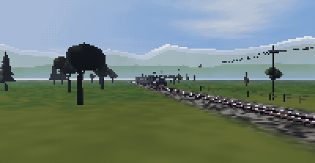
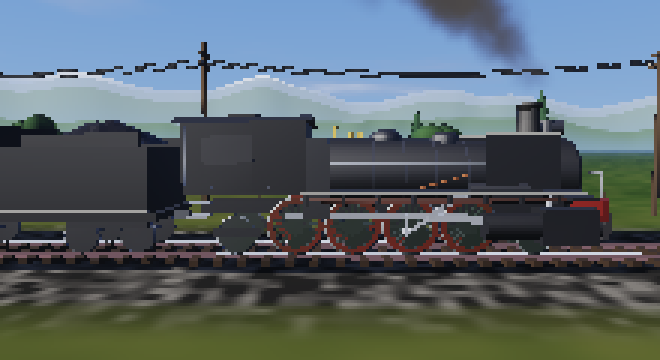
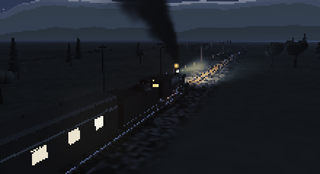

# sl-real

端末の中を、本物の蒸気機関車が走ります。

`sl` の 3D 版です。アスキーアートではなく、ソフトウェアラスタライザで組んだ
3D シーンを毎フレーム描き、ハーフブロック文字 `▀` と 24bit カラーで
1 セル 2 ピクセルとして端末に出します。







## 何が「リアル」なのか

- **本物の 3D**。透視投影・Z バッファ・近クリップ面付きの自前ラスタライザ。
  カメラは自由に動かせて、機関車は 12m の実寸でモデリングしてあります。
- **走り装置が実機の機構で動く**。連結棒・主連棒はもちろん、
  返りクランクから加減リンク・加減棒・合併テコ・弁棒まで
  ワルシャート式弁装置一式を、リンク長の拘束を解いて動かしています
  （2 円の交点を毎フレーム求めています）。左右の動輪は 90 度ずらしてあります。
- **煙が物理で出る**。煙突からのドラフトは動輪 1 回転につき 4 拍。
  浮力・空気抵抗・3D ノイズの乱流で、上がって流れて広がって薄まります。
  シリンダのドレンと安全弁からは白い蒸気が別に吹きます。
- **時刻で光が変わる**。太陽高度から昼・薄明・夜を連続的に作り、
  空の勾配、太陽と月、星、雲、遠景の山の空気遠近まで
  カメラレイを 1 ピクセルずつ解いて描いています。
  夜は月が主光源になり、暗部の彩度が落ちて青みがかります（薄明視）。
- **金属が金属に見える**。黒い車体の立体感はほとんど空の映り込みでできています。
  反射方向から空か地面の色を引き、粗さで反射のぼけ具合と彩度を変えます。
- **列車が地面に影を落とす**。地面のシェーダの中で、
  太陽へ向かう線分と車体のバウンディングボックスの交差長から半影付きで求めます。
- **視差は本物**。遠景の山は垂直な円筒との交点で解いているので、
  レイヤーごとに正しい速さで流れます。
- そのほか、煙突から出る火の粉、火室の炎の揺らぎ、乗務員のシルエット、
  夜に灯る客車の室内灯、バネ上の揺れ、煤と錆の汚れ、リベット、
  ブルームなど。

## ビルド

```sh
cargo build --release
./target/release/sl-real
```

`sl` として使うなら:

```sh
cargo install --path .
alias sl=sl-real
```

## 使い方

```
sl-real [オプション]

  --speed <m/s>     走行速度 (既定 21)
  --cars <n>        客車の両数 (既定 3)
  --time <0-24>     時刻。夕焼けや夜景が変わる (既定: 現在時刻)
  --clouds <0-1>    雲の量 (既定 0.45)
  --camera <mode>   trackside | chase | low | orbit | cab
  --loop            通り過ぎても終わらない
  --fps <n>         目標フレームレート (既定 30)
  --fov <deg>       垂直画角 (既定 42)
  --seed <n>        風景の乱数種
  --fly             機関車が飛ぶ
  --hud             速度などの情報を重ねる
```

操作: `q` 終了 / `space` 一時停止 / `c` カメラ切替 / `+` `-` 速度 /
`[` `]` 時刻 / `f` 飛ぶ / `h` HUD

### 見どころ

```sh
sl-real --camera low --speed 28      # レールすれすれを通過していく
sl-real --time 18.4 --camera trackside  # 夕暮れの逆光
sl-real --time 23 --camera chase     # 前照灯とかまどの火だけの夜
sl-real --camera cab --loop          # 機関士の目線でひたすら走る
sl-real --camera orbit --cars 6      # 編成をぐるりと回って見る
```

### 開発用

```sh
sl-real --screenshot out.ppm --at 4.2 --size 480x270   # 1 枚だけ書き出す
sl-real --record frames/f --frames 120 --fps 20        # 連番で書き出す
sl-real --bench 100 --size 200x100                     # 描画速度を測る
```

## 必要なもの

24bit カラー（truecolor）に対応した端末。
`alacritty`, `foot`, `kitty`, `ghostty`, `wezterm`, 最近の `gnome-terminal` などは対応しています。

## 速さ

背景パスは行の帯に分けて全コアで解き、ジオメトリは視錐台カリングと
距離に応じた分割数の調整（LOD）で減らしています。
16 コアの環境での実測（`--bench`）は、
200x50 の端末で 15.2 ms/frame（66fps）、320x80 で 20.2 ms/frame（50fps）。

## 構成

| ファイル | 中身 |
| --- | --- |
| `src/math.rs` | ベクトルと 4x4 行列 |
| `src/noise.rs` | 値ノイズ、fbm、小型 PRNG |
| `src/render.rs` | ラスタライザ、陰影、ブルーム、端末への出力 |
| `src/mesh.rs` | 変換行列スタックとプリミティブ生成 |
| `src/sky.rs` | 空・太陽・月・星・雲・山・地面（背景パス） |
| `src/train.rs` | 機関車・炭水車・客車・線路・沿線 |
| `src/smoke.rs` | 煙と蒸気のパーティクル |
| `src/main.rs` | 引数、カメラ、メインループ |
